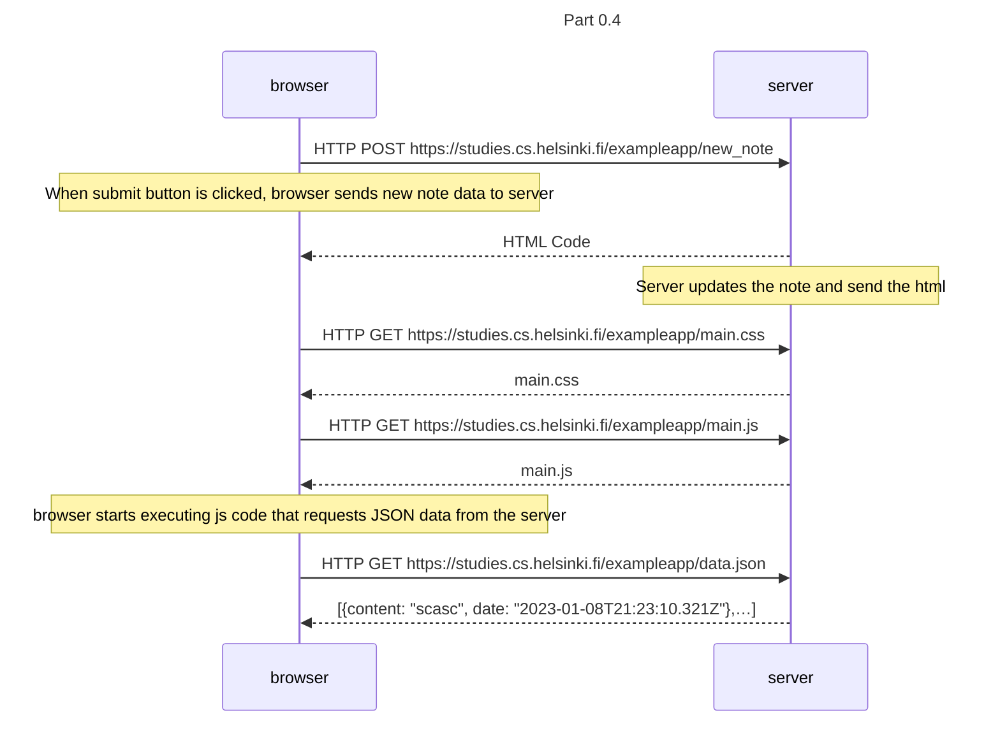

```mermaid
sequenceDiagram
title Part 0.4
browser->>server: HTTP POST https://studies.cs.helsinki.fi/exampleapp/new_note
Note over browser: When submit button is clicked, browser sends new note data to server 
server-->>browser: HTML Code
Note over server: Server updates the note and send the html
browser->>server: HTTP GET https://studies.cs.helsinki.fi/exampleapp/main.css
server-->>browser: main.css
browser->>server: HTTP GET https://studies.cs.helsinki.fi/exampleapp/main.js
server-->>browser: main.js
Note over browser: browser starts executing js code that requests JSON  data from the server
browser->>server: HTTP GET https://studies.cs.helsinki.fi/exampleapp/data.json
server-->>browser: [{content: "scasc", date: "2023-01-08T21:23:10.321Z"},…]


```