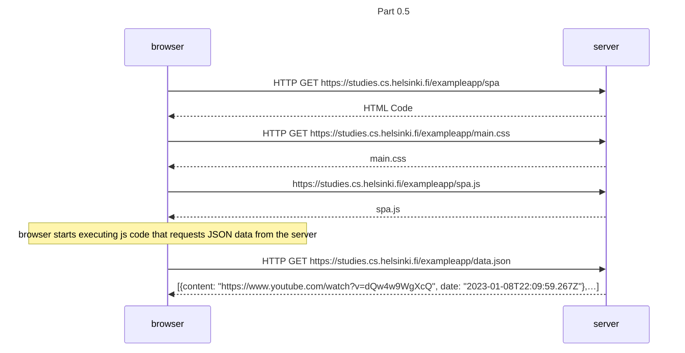

```mermaid
sequenceDiagram
title Part 0.5
browser->>server: HTTP GET https://studies.cs.helsinki.fi/exampleapp/spa 
server-->>browser: HTML Code

browser->>server: HTTP GET https://studies.cs.helsinki.fi/exampleapp/main.css
server-->>browser: main.css
browser->>server: https://studies.cs.helsinki.fi/exampleapp/spa.js
server-->>browser: spa.js
Note over browser: browser starts executing js code that requests JSON  data from the server
browser->>server: HTTP GET https://studies.cs.helsinki.fi/exampleapp/data.json
server-->>browser: [{content: "https://www.youtube.com/watch?v=dQw4w9WgXcQ", date: "2023-01-08T22:09:59.267Z"},…]


```