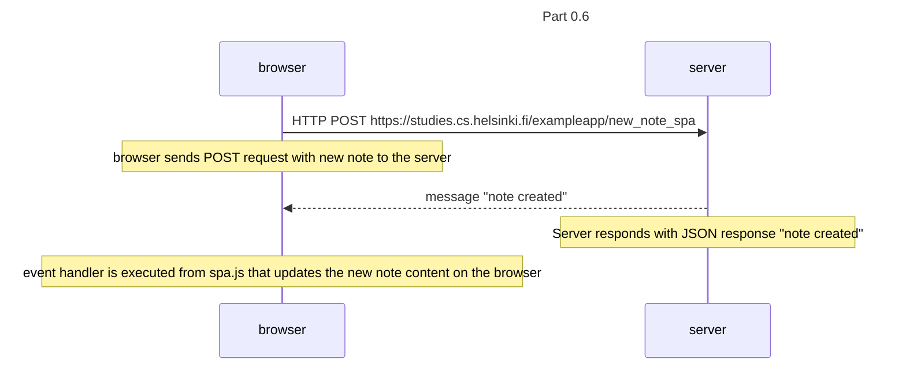

```mermaid
sequenceDiagram
title Part 0.6
browser->>server:HTTP POST https://studies.cs.helsinki.fi/exampleapp/new_note_spa 
Note over browser: browser sends POST request with new note to the server
server-->>browser: message "note created"
Note over server: Server responds with JSON response "note created"
Note over browser: event handler is executed from spa.js that updates the new note content on the browser


```